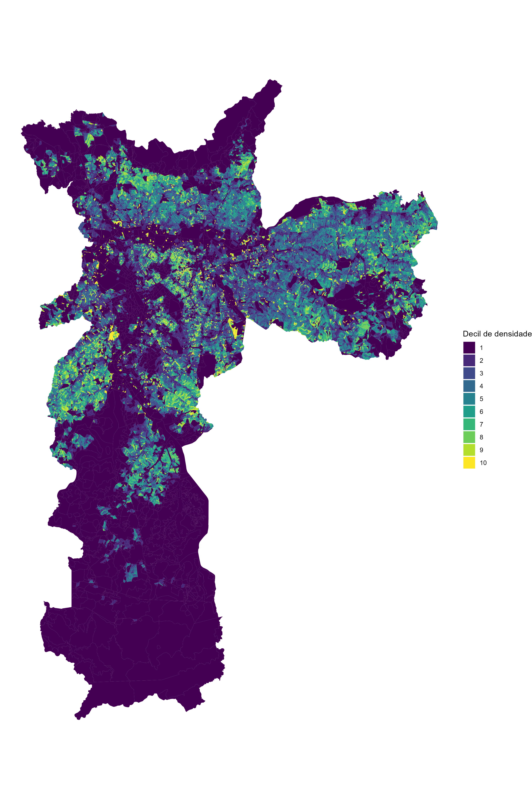
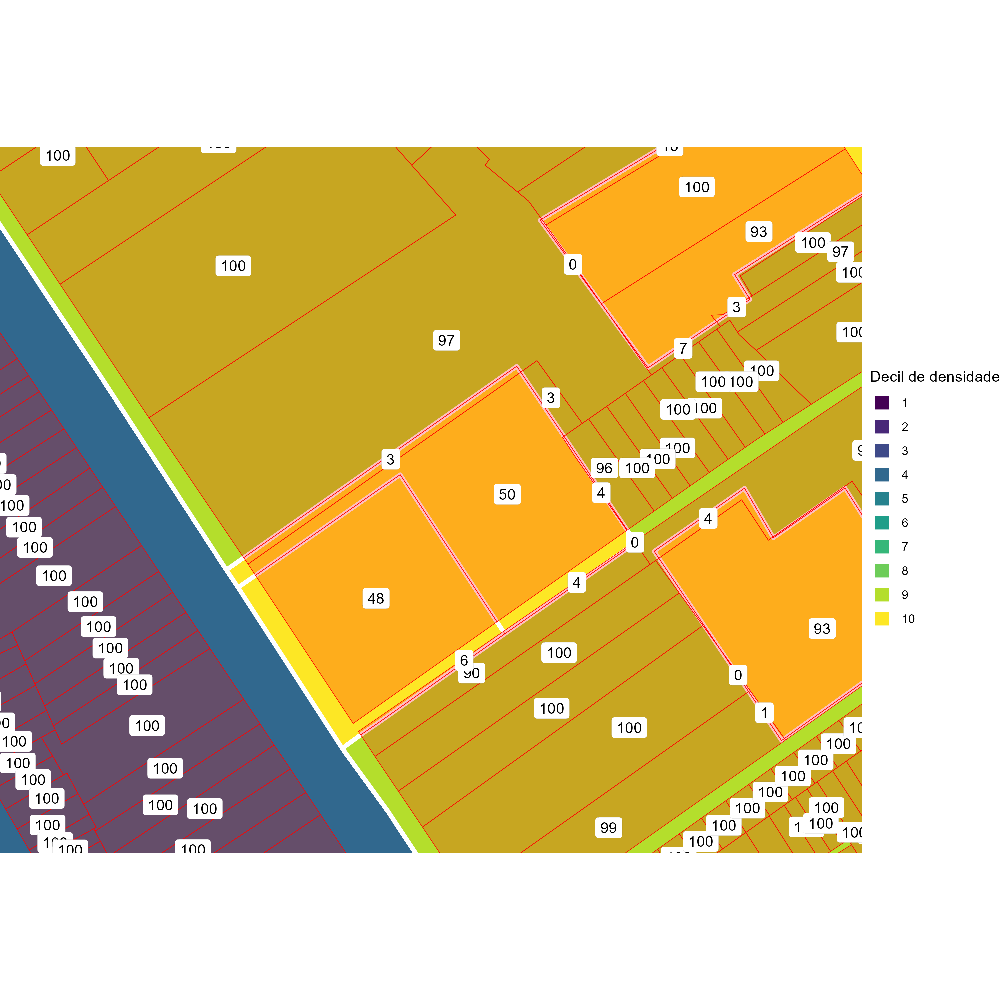
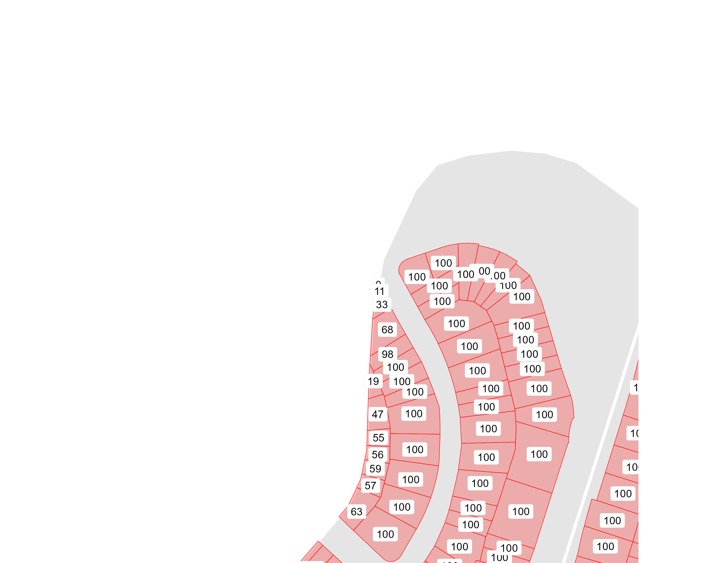

```{r, warning = FALSE, message = FALSE}
library(tidyverse)
library(sf)
library(kableExtra)
library(knitr)
library(units)
```


```{r setup, include=FALSE}
opts_chunk$set(echo = TRUE, warning = FALSE, message = FALSE, cache.lazy = FALSE)
setwd("C:/git/densidade")
```

# GeoSampa e bases utilizadas

## Geosampa
GeoSampa é o portal de mapas e dados geoespaciais da cidade de São Paulo, mantido pela prefeitura. Ele fornece uma vasta gama de informações geográficas, incluindo mapas, dados demográficos, infraestruturas e muito mais. Este portal é uma ferramenta valiosa para pesquisadores, urbanistas e qualquer pessoa interessada em informações espaciais detalhadas sobre a cidade.

## Lotes
Base de Lotes: No GeoSampa, a base de lotes representa a divisão da cidade em pequenos segmentos, geralmente correspondentes a terrenos individuais ou lotes. Esta base está organizada de forma que cada bairro tem seu próprio conjunto de dados e os dados de lotes para cada bairro podem ser baixados diretamente do site do GeoSampa em formato zip, contendo arquivos como .shp (shapefile), .dbf (database file), e .shx (index file).

```{r}
# Extração do zip file com lotes de cada bairro
if (!"zip" %in% list.files(path = "dados/lotes")){
  for (file in list.files(path="dados/lotes/zip", full.names = FALSE) %>% 
       str_remove("\\.zip")){
    unzip(paste("dados/lotes/zip/", file, ".zip", sep = ""), 
          paste(file, "/", file, ".shp", sep = ""), 
          exdir = "dados/lotes/unzip")
    unzip(paste("dados/lotes/zip/", file, ".zip", sep = ""), 
          paste(file, "/", file, ".dbf", sep = ""), 
          exdir = "dados/lotes/unzip")
    unzip(paste("dados/lotes/zip/", file, ".zip", sep = ""), 
          paste(file, "/", file, ".shx", sep = ""), 
          exdir = "dados/lotes/unzip")
  }
}
```

```{r lotes_bruto, cache = TRUE}
lotes <- list.files(path="dados/lotes/unzip", full.names = FALSE) %>% 
    paste("dados/lotes/unzip/", ., "/", ., ".shp", sep = "") %>% 
    lapply(read_sf) %>% 
    bind_rows %>% 
    st_set_crs("epsg:31983") 

```

```{r, echo = FALSE}
lotes %>% 
  ungroup() %>% sample_n(10) %>% 
  kbl() %>% 
  kable_styling(bootstrap_options = c("striped", "hover", "condensed", "responsive"),
                font_size = 10)
```

```{r plot_lotsizes, cache = TRUE}
lotes %>% 
  mutate(condominio = case_when(lo_condomi == "00" ~ "Unidade",
                                lo_condomi != "00" ~ "Condomínio"),
         tipo = case_when(lo_tp_lote == "F" ~ "Fiscal",
                          lo_tp_lote == "M" ~ "Espaço livre",
                          lo_tp_lote == "V" ~ "Via de acesso",
                          .default = NA),
         area = st_area(geometry) %>% as.numeric()) %>% 
  st_drop_geometry() %>% 
  ggplot() +
  geom_violin(aes(x = factor(condominio), y = area, fill = tipo)) +
  scale_y_log10(labels = scales::comma_format(big.mark = ".")) +
  labs(title = "Área dos lotes em SP" , x = "", y = "Área em metros quadrados", fill = "Tipo de lote") +
  theme_classic()
```


# SQL dos Lotes (Setor, Quadra e Lote)
Na base de dados de lotes, cada lote é identificado por três componentes principais:

1. Setor (lo_setor): Uma divisão maior dentro do município que agrupa várias quadras.
2. Quadra (lo_quadra): Uma subdivisão dentro de um setor que agrupa vários lotes.
3. Lote (lo_lote): A menor unidade de divisão, que representa um terreno ou uma parcela específica dentro de uma quadra.
Essa estrutura de Setor-Quadra-Lote é crucial para identificar de forma única cada lote dentro do município. No código, esses identificadores são utilizados para manipular e cruzar os dados de lotes com outras bases de dados, como a base de IPTU.

```{r lotes_tratado, cache = TRUE}
lotes <- lotes %>% 
 filter(lo_tp_lote == "F") %>% # Seleção apenas de lotes fiscais
  mutate(lo_lote = ifelse(lo_lote == "0000", paste("CD", lo_condomi, sep = ""), lo_lote)) %>% 
  select(setor = lo_setor, quadra = lo_quadra, lote = lo_lote)
```

```{r, echo = FALSE}
lotes %>% 
  filter(!startsWith(lote, "CD")) %>% 
  ungroup() %>% sample_n(5) %>% 
  kbl() %>% 
  kable_styling(bootstrap_options = c("striped", "hover", "condensed", "responsive"),
                font_size = 10)
```


```{r, echo = FALSE}
lotes %>% 
  ungroup() %>% 
  filter(startsWith(lote, "CD")) %>% 
  sample_n(5) %>% 
  kbl() %>% 
  kable_styling(bootstrap_options = c("striped", "hover", "condensed", "responsive"),
                font_size = 10)
```

# Base de Dados do IPTU

A base de dados do IPTU (Imposto Predial e Territorial Urbano) é uma fonte abrangente de informações sobre imóveis urbanos dentro do município. Essa base é considerada completa, pois abrange todos os imóveis sujeitos à tributação do IPTU, representando uma fonte confiável e abrangente de informações sobre a propriedade urbana.

Essa base é crucial para a gestão tributária municipal, fornecendo dados detalhados sobre os imóveis, incluindo sua localização, características físicas e valores venais. A inclusão de todos os imóveis tributáveis garante que a base do IPTU proporcione uma visão abrangente do mercado imobiliário urbano dentro do município.

O número do contribuinte, utilizado para identificar exclusivamente cada imóvel na base de dados do IPTU, é representado diretamente pelo SQL, sendo essencial para consultas e manipulação dos dados relacionados ao imposto predial e territorial urbano. Esse formato permite a integração e cruzamento com outras bases de dados, como a base de lotes, que está georreferenciada, fornecendo informações espaciais adicionais que não estão disponíveis na base do IPTU.

## Procedimento para Lotes de Condomínios

Quando um lote é um condomínio, ou seja, quando não se classifica de acordo com `condominio == "00-0"`, é necessário substituir os múltiplos números de SQL pelo número do condomínio. Isso ocorre porque cada unidade dentro do condomínio pode ser tratada como uma entidade separada para fins tributários, mas para a base de lotes, estão todos juntos.


```{r IPTU_bruto, cache = TRUE}
IPTU <- read.csv("dados/IPTU/IPTU_2024.csv", sep=";", encoding = "latin1") %>% 
    as_tibble() %>% 
    select(sql = "NUMERO.DO.CONTRIBUINTE", 
           bairro = "BAIRRO.DO.IMOVEL",
           condominio = "NUMERO.DO.CONDOMINIO",
           area_terreno = "AREA.DO.TERRENO",
           area_construida = "AREA.CONSTRUIDA",
           area_ocupada = "AREA.OCUPADA",
           pavimentos = "QUANTIDADE.DE.PAVIMENTOS",
           ano_construcao = "ANO.DA.CONSTRUCAO.CORRIGIDO",
           tipo = "TIPO.DE.PADRAO.DA.CONSTRUCAO") %>% 
    
    # Separação do número de contribuinte (SQL) em setor quadra e lote
    mutate(setor =  str_sub(sql, 1, 3),
           quadra = str_sub(sql, 4, 6),
           
           # Quando o lote é um condomínio, haverá vários SQLs no mesmo lote. CD = Condomínio
           lote = str_sub(sql, 7, 10) %>% 
             ifelse(condominio == "00-0", ., paste("CD", str_sub(condominio, 1, 2), sep = "")),
           
           # Tipo de uso
           residencial = str_detect(tipo, "Residencial")) 
```

```{r, echo = FALSE}
IPTU %>% 
  ungroup() %>% sample_n(10) %>% 
  kbl() %>% 
  kable_styling(bootstrap_options = c("striped", "hover", "condensed", "responsive"),
                font_size = 10)
```

```{r}
IPTU.tipos <- IPTU %>% 
  group_by(tipo) %>% 
  summarize(n = n()) %>% 
  mutate(percentual = n/sum(n)) %>% 
  rename("Tipo de contribuinte" = tipo)
```

```{r, echo = FALSE}
IPTU.tipos %>% 
  kbl() %>% 
  kable_styling(bootstrap_options = c("striped", "hover", "condensed", "responsive"),
                font_size = 10)
remove(IPTU.tipos)
```

```{r grafico_area_construida, cache = TRUE}
IPTU %>% 
  mutate(uso = case_when(str_detect(tipo, "Residencial") ~ "Residencial",
                         str_detect(tipo, "Comercial") ~ "Comercial",
                         str_detect(tipo, "Oficina") ~ "Industria",
                         str_detect(tipo, "garagens") ~ "Garagem",
                         str_detect(tipo, "TERRENO") ~ "Terreno",
                         str_detect(tipo, "Clube") ~ "Entretenimento",
                         .default = "Outros"),
         padrao = case_when(str_detect(tipo, "A$") ~ "A",
                            str_detect(tipo, "B$") ~ "B",
                            str_detect(tipo, "C$") ~ "C",
                            str_detect(tipo, "D$") ~ "D",
                            str_detect(tipo, "E$") ~ "E",
                            .default = "NA")) %>% 
  
  group_by(uso, padrao) %>% 
  summarize(area = sum(area_construida)) %>% 
  ggplot() +
  treemapify::geom_treemap(aes(fill = uso, area = area), size = 2) +
  treemapify::geom_treemap(aes(alpha = padrao, area = area), fill = "black") +
  scale_fill_manual(values = c("Residencial" = "#FAE48B", 
                               "Comercial" = "#A6EEE6",
                               "Garagem" = "#1A5354",
                               "Industria" = "#84BD00",
                               "Entretenimento" = "#FB6467",
                               "Outros" = "white")) +
  scale_alpha_manual(values = c("A" = 0, "B" = .075, "C" = .15, "D" = .225, "E" = .3, "NA" = 0)) +
  labs(title = "Área construída em SP por tipo de uso", fill = "Tipo de uso", alpha = "Parão de uso") +
  theme(aspect.ratio=1)
```


## Agrupamento dos condomínios

Quando há um condomínio com múltiplos contribuintes de IPTU, ele deve ser agregado a nível lote, para que possa ser cruzado com a base de lotes, possibilitando que seja georreferenciada. Todos os contribuintes dentro de um condomínio compartilham das mesmas características de área de terreno, área ocupada, ano de construção e pavimentos, então a mediana funciona para agregar estes dados, mas o máximo, mínimo, média ou pegar o primeiro valor também funcionaria.

Como a análise é sobre a densidade residencial, foram considerados apenas os contribuintes que apresentam propriedades residenciais.

```{r IPTU_tratado, cache = TRUE}
IPTU <- IPTU %>% 
  group_by(setor, quadra, lote) %>% 
  
  # No caso de condomínios, calcula quando aquele IPTU representa o lote, com base na área construída
  mutate(percent_area = (area_construida / sum(area_construida))) %>% 
  
  # Remoção de IPTUs não residenciais
  filter(residencial) %>% 
  
  # Agregar por SQL
  group_by(setor, quadra, lote) %>% 
  summarize(unidades = n(),
            area_terreno = median(area_terreno), 
            area_construida = sum(area_construida), 
            area_ocupada = median(area_ocupada),
            pavimentos = median(pavimentos),
            ano_construcao = median(ano_construcao))
```

```{r, echo = FALSE}
IPTU %>% 
  ungroup() %>% sample_n(10) %>% 
  kbl() %>% 
  kable_styling(bootstrap_options = c("striped", "hover", "condensed", "responsive"),
                font_size = 10)
```

```{r plot_verticalizacao, cache = TRUE}
IPTU %>% 
  ungroup() %>% 
  arrange(pavimentos) %>% 
  mutate(grupo = cumsum((row_number() %% 100) == 0)) %>%
  group_by(grupo) %>% 
  summarize(pavimentos = median(pavimentos)) %>% 
  mutate(grupo = grupo / max(grupo)) %>%
  ggplot() +
  geom_area(aes(x = grupo, y = pavimentos)) +
  scale_x_continuous(labels = scales::percent) +
  labs(x = "Percentual de lotes residenciais da cidade", y = "Pavimentos", 
       title = "Perfil de verticalização residencial de SP") +
  theme_classic()
  
```

# Join entre a Base de Lotes e a Base do IPTU

```{r join_IPTU-lotes, cache = TRUE}
# Join dos lotes com IPTU com base no SQL
IPTU.lotes <- IPTU %>% 
  left_join(lotes, by = join_by(setor, quadra, lote)) %>% 
  ungroup()
```

```{r, echo = FALSE}
remove(IPTU)
remove(lotes)

IPTU.lotes %>% 
  ungroup() %>% sample_n(10) %>% 
  kbl() %>% 
  kable_styling(bootstrap_options = c("striped", "hover", "condensed", "responsive"),
                font_size = 10)
```

# Erros no join

Há alguns casos em que o join não encontra match na base de dados dos lotes. Uma possível explicação para este descompasso pode ser a desatualização da base do IPTU, visto que no geosampa a base de lotes sempre é a mais atualizada, visto que toda vez em que um lote é modificado ou surgem novos lotes, esta base é atualizada. Possivelmente a base do IPTU perdeu essas eventuais atualizações.

Uma possibilidade para contornar isso seria cruzar o setor e quadra do SQL, sem juntar com o lote com a base de quadras. Essa abordagem perderia um pouco da exatidão geográfica. Outra possibilidade seria de utilizar dados do logradouro para georreferenciar estes SQLs perdidos. Entretanto, como são dados residuais, isso tem impacto negligenciável na análise.

```{r erro_join, cache = TRUE}
erro_join <- IPTU.lotes %>% 
  mutate(erro = geometry %>% st_is_empty()) %>% 
  st_drop_geometry() %>% 
  group_by(erro) %>% 
  summarize(n = n(),
            unidades = sum(unidades),
            area_construida = sum(area_construida)) %>% 
  mutate(prop = n/sum(n),
         prop_unidades = unidades / sum(unidades),
         prop_area_construida = area_construida / sum(area_construida))
```

```{r, echo = FALSE}
erro_join %>% 
  kbl() %>% 
  kable_styling(bootstrap_options = c("striped", "hover", "condensed", "responsive"),
                font_size = 10)

remove(erro_join)
```

```{r erros_geografica, cache = TRUE}
setor <- read_sf("dados/setor/SIRGAS_SHP_setorfiscal.shp") %>% 
  st_set_crs("epsg:31983") %>% 
  select(st_codigo)

IPTU.lotes %>% 
  mutate(erro = geometry %>% st_is_empty()) %>% 
  filter(erro) %>% 
  group_by(setor) %>% 
  summarize(erros = n())  %>%
  mutate(erros = cut(erros, breaks = c(0, 50, 100, 200, 500, 1000, Inf))) %>% 
  left_join(setor, join_by(setor == st_codigo)) %>% 
  ggplot() +
  geom_sf(data = setor, color = "white") +
  geom_sf(aes(geometry = geometry, fill = factor(erros)), color = "white") +
  scale_fill_viridis_d() +
  labs(fill = "Número de erros", title = "Distribuição geográfica dos erros de join") +
  theme_void()
  
```

```{r, echo = FALSE}
remove(setor, erro_join)
```

# Uso dos Microdados do Censo de 2022 para Análise Geoespacial

Os microdados do Censo de 2022 são uma fonte crucial de informações para sua análise geoespacial, oferecendo insights detalhados sobre a população e suas características socioeconômicas. Esses dados fornecem uma visão abrangente da distribuição da população e de suas condições de vida em nível local, permitindo uma análise mais precisa e contextualizada para seu problema específico.

É importante destacar que os resultados disponíveis são parciais do censo, com dados atualizados até o momento da divulgação. No entanto, mesmo parciais, esses dados podem ser extremamente úteis para suas análises.

Um ponto crucial a considerar é que o nível mínimo de observação georreferenciada nos microdados do censo são os setores censitários. Os setores censitários são unidades geográficas definidas pelo Instituto Brasileiro de Geografia e Estatística (IBGE) para coleta e tabulação de dados censitários. Eles são delimitados de forma a garantir uma cobertura completa e homogênea de todo o território nacional, facilitando a análise comparativa entre diferentes áreas geográficas.

Cada setor censitário abrange uma determinada área geográfica e possui um conjunto de informações demográficas e socioeconômicas associadas a ele, o que permite uma análise detalhada das características da população em cada região. Portanto, ao realizar sua análise geoespacial utilizando os microdados do censo, os setores censitários servirão como a unidade básica de observação, fornecendo a base para suas análises espaciais e a contextualização dos resultados.


```{r read_censo, cache = TRUE}
# Read dados do censo 2022
censo <- read_sf("dados/censo/SP_Malha_Preliminar_2022.shp") %>% 
  filter(CD_MUN == "3550308") %>% 
  st_transform("epsg:31983") %>% # Sistema de coordenadas do geosampa
  select(id_setor_censitario = CD_SETOR, v0001:v0007) %>% 
  mutate(area_setor = st_area(geometry))
```

```{r, echo = FALSE}
censo %>% 
  ungroup() %>% sample_n(10) %>% 
  kbl() %>% 
  kable_styling(bootstrap_options = c("striped", "hover", "condensed", "responsive"),
                font_size = 10)
```

```{r plot_censo, cache = TRUE}
gg <- ggplot() +
  geom_sf(data = censo %>%
            mutate(densidade = v0001/area_setor,
                   decil = ntile(densidade, 10)),
          aes(fill = factor(decil)), color = NA) +
  scale_fill_viridis_d() +
  labs(fill = "Decil de densidade") +
  theme_void()

ggsave("tex/imagens/mapa.png", gg, width = 20, height = 20, dpi = 400)
```

```{r, echo=FALSE, out.width = '100%'}

```

```{r}
descritiva <- censo %>% 
  st_drop_geometry() %>% 
  summarize("Total de pessoas" = sum(v0001),
            "Total de Domicílios" = sum(v0002),
            "Total de Domicílios Particulares Ocupados" = sum(v0007)) %>% 
  pivot_longer(everything())
```

```{r, echo = FALSE}
descritiva %>% 
  kbl() %>% 
  kable_styling(bootstrap_options = c("striped", "hover", "condensed", "responsive"),
                font_size = 10)
```

# Cruzamento entre a Base do Censo e a Base do IPTU

O processo de cruzamento foi realizado com base na intersecção das geometrias dos setores censitários e dos lotes do IPTU. Cada setor censitário e cada lote do IPTU possui uma geometria associada, representando sua área geográfica no mapa. Ao cruzar essas geometrias, é possível identificar quais lotes estão contidos em cada setor censitário e vice-versa.

É importante destacar que, em casos onde um lote foi dividido entre dois ou mais setores censitários, ocorrerá uma intersecção em ambas as áreas. Para lidar com essa situação, foi calculado o percentual da área do lote que está contida em cada setor censitário.


```{r join_IPTU-censo, cache = TRUE}
# Join dados do IPTU com do Censo através da intersecção das geometrias
IPTU.censo <- censo %>% 
  st_intersection(IPTU.lotes %>% st_as_sf()) %>% 
  as_tibble() %>% 
  rename(geometria_intersec = geometry) %>% 
  
  # Retomada das geometrias do setor e lotes
  left_join(censo %>% as_tibble() %>% select(id_setor_censitario, geometria_setor_censitario = geometry),
            by = join_by(id_setor_censitario)) %>% 
  left_join(IPTU.lotes %>% as_tibble() %>% select(setor, quadra, lote, geometria_lote = geometry),
            by = join_by(setor, quadra, lote)) %>% 
  
  # Cálculo de quanto % do lote da dentro do setor
  mutate(percent_intersec = as.numeric(st_area(geometria_intersec) / st_area(geometria_lote)))
```

```{r, echo = FALSE}
remove(IPTU.lotes)

IPTU.censo %>% 
  ungroup() %>% sample_n(10) %>% 
  kbl() %>% 
  kable_styling(bootstrap_options = c("striped", "hover", "condensed", "responsive"),
                font_size = 10)
```


```{r}
# Função para plotar um setor censitário ou SQL específico
view_geomtria <- function(geometria, zoom_out, colorir = TRUE){
  
  bbox <- geometria %>% 
    st_transform("epsg:31983") %>% 
    st_bbox()
  
  x_min <- (bbox$xmin - zoom_out) %>% as.numeric()
  y_min <- (bbox$ymin - zoom_out) %>% as.numeric()
  x_max <- (bbox$xmax + zoom_out) %>% as.numeric()
  y_max <- (bbox$ymax + zoom_out) %>% as.numeric()
  
  corte <- list(xmin = x_min - zoom_out, ymin = y_min - zoom_out, 
                xmax = x_max + zoom_out, ymax = y_max + zoom_out)
  
  df <- IPTU.censo %>%
    st_as_sf() %>%
    st_transform("epsg:31983") %>% 
    st_crop(corte %>% unlist()) %>% 
    mutate(densidade = v0001/area_setor,
           decil = ntile(densidade, 10),
           percent_intersec = round(percent_intersec * 100))
  
  if (colorir == TRUE){
    df %>% 
      ggplot() +
      geom_sf(aes(geometry = geometria_setor_censitario, fill = factor(decil)), color = "white", lwd = 1.5) +
      geom_sf(aes(geometry = geometria_intersec), fill = "red", color = "red", alpha = .25) +
      geom_sf_label(aes(geometry = geometria_intersec, label = percent_intersec), label.size = .01) +
      scale_fill_viridis_d() +
      labs(fill = "Decil de densidade") +
      theme(legend.position = "none") +
      coord_sf(xlim = c(x_min, x_max), ylim = c(y_min, y_max)) +
      theme_void()
  }else{
    df %>% 
      ggplot() +
      geom_sf(aes(geometry = geometria_setor_censitario), color = "white", lwd = 1.5) +
      geom_sf(aes(geometry = geometria_intersec), fill = "red", color = "red", alpha = .25) +
      geom_sf_label(aes(geometry = geometria_intersec, label = percent_intersec), label.size = .01) +
      scale_fill_viridis_d() +
      labs(fill = "Decil de densidade") +
      theme(legend.position = "none") +
      coord_sf(xlim = c(x_min, x_max), ylim = c(y_min, y_max)) +
      theme_void()
  }
    
}
```

# Exemplo de lote que é cortado por setor censitário

Demonstrativo do que acontece quando um lote está dividido em mais de um setor censitário. No fundo, há os setores censitários, coloridos de acordo com a densidade. Em vermelho, estão as geometrias dos lotes. Quando o lote não é cortado, sua área fica integralmente em um setor censitário. Quando um setor corta um lote, sua área é distribuída e o número representa o percentual da área que fica em cada setor censitário.


```{r mapa_lote_cortado, cache=TRUE}
gg <- view_geomtria(IPTU.censo %>% 
                filter(id_setor_censitario == "355030810000143P") %>% 
                select(geometria_setor_censitario) %>% 
                st_as_sf(),
              zoom_out = 50)

ggsave("tex/imagens/mapa_lote_corte.png", gg, width = 10, height = 10, dpi = 300)
```


```{r, echo=FALSE, out.width = '100%'}

```

# Casos de erro do procedimento

A seguir estão os casos em que a soma do percentual da intersecção não é 1. Teoricamente a soma sempre precisa ser 1. 

```{r}
caso.erro <- IPTU.censo %>%
  group_by(setor, quadra, lote) %>% 
  mutate(soma_percent_intersec = sum(percent_intersec) %>% round(2)) %>% 
  filter(soma_percent_intersec < 1)
```


```{r, echo = FALSE}
caso.erro %>% 
  ungroup() %>% sample_n(10) %>% 
  kbl() %>% 
  kable_styling(bootstrap_options = c("striped", "hover", "condensed", "responsive"),
                font_size = 10)

remove(caso.erro)
```

# Mapa de um dos casos de erro

É possível observar que nestes casos, a soma do percentual não é 1 porque estão na borda da cidade, então o resto do lote se encontra em outros municípios. Estes erros não vão causar problemas.

```{r mapa_erro, cache = TRUE}
gg <- view_geomtria(IPTU.censo %>% 
                filter(setor == "160", quadra == "128", lote == "0008") %>% 
                select(geometria_lote) %>% 
                st_as_sf(),
              zoom_out = 100,
              colorir = FALSE)

ggsave("tex/imagens/mapa_erro.png", gg, width = 10, height = 10, dpi = 300)

```


```{r, echo=FALSE, out.width = '100%'}

```


```{r}
# Import dados geosampa de distritos
distrito <- read_sf("dados/distrito/SIRGAS_SHP_distrito.shp") %>% st_set_crs("epsg:31983")
onibus <- read_sf("dados/onibus/SIRGAS_SHP_pontoonibus.shp") %>% st_set_crs("epsg:31983")
metro <- read_sf("dados/metro/SIRGAS_SHP_estacaometro_point.shp") %>% st_set_crs("epsg:31983")
```

```{r lote_metro, cache = TRUE}
lote_metro <- IPTU.censo %>% 
  st_set_geometry("geometria_lote") %>% 
  mutate(centroide_lote = st_centroid(geometria_lote),
         metro = st_nearest_feature(centroide_lote, metro)) %>% 
  left_join(metro %>% 
              as_tibble() %>% 
              mutate(rn = row_number()) %>% 
              rename(geomeria_metro = geometry), by = join_by(metro== rn)) %>% 
  mutate(distancia_metro = st_distance(centroide_lote, geomeria_metro,  by_element=TRUE)) %>% 
  as_tibble()
```


```{r, echo = FALSE}
lote_metro %>% 
  ungroup() %>% ungroup() %>% sample_n(10) %>% 
  kbl() %>% 
  kable_styling(bootstrap_options = c("striped", "hover", "condensed", "responsive"),
                font_size = 10)
```

```{r lote_metro_mapa, cache = TRUE}
lote_metro <- lote_metro %>% 
  st_set_geometry("centroide_lote") %>% 
  st_crop(distrito %>% 
            filter(ds_nome == "SE")) %>% 
  st_set_geometry("geomeria_metro") %>% 
  st_crop(distrito %>% 
            filter(ds_nome == "SE")) %>% 
  as_tibble() %>% 
  pivot_longer(cols = c(centroide_lote, geomeria_metro)) %>% 
  st_set_geometry("value") %>% 
  group_by(setor, quadra, lote) %>% 
  summarize(do_union = FALSE) %>% 
  st_cast("LINESTRING")

gg <- ggplot() +
  geom_sf(data = IPTU.censo %>% 
            st_set_geometry("geometria_lote") %>% 
            st_crop(distrito %>% 
                      filter(ds_nome == "SE")),
          aes(geometry = geometria_lote)) +
  geom_sf(data = lote_metro, alpha = .1, color = "darkblue") +
  geom_sf(data = metro %>% st_crop(distrito %>% filter(ds_nome == "SE")), color = "red") +
  theme_void()

ggsave("tex/imagens/mapa_metro.png", gg, width = 10, height = 10, dpi = 300)
```

```{r, echo=FALSE, out.width = '100%'}
knitr::include_graphics("tex/imagens/mapa_metro.png")
```


