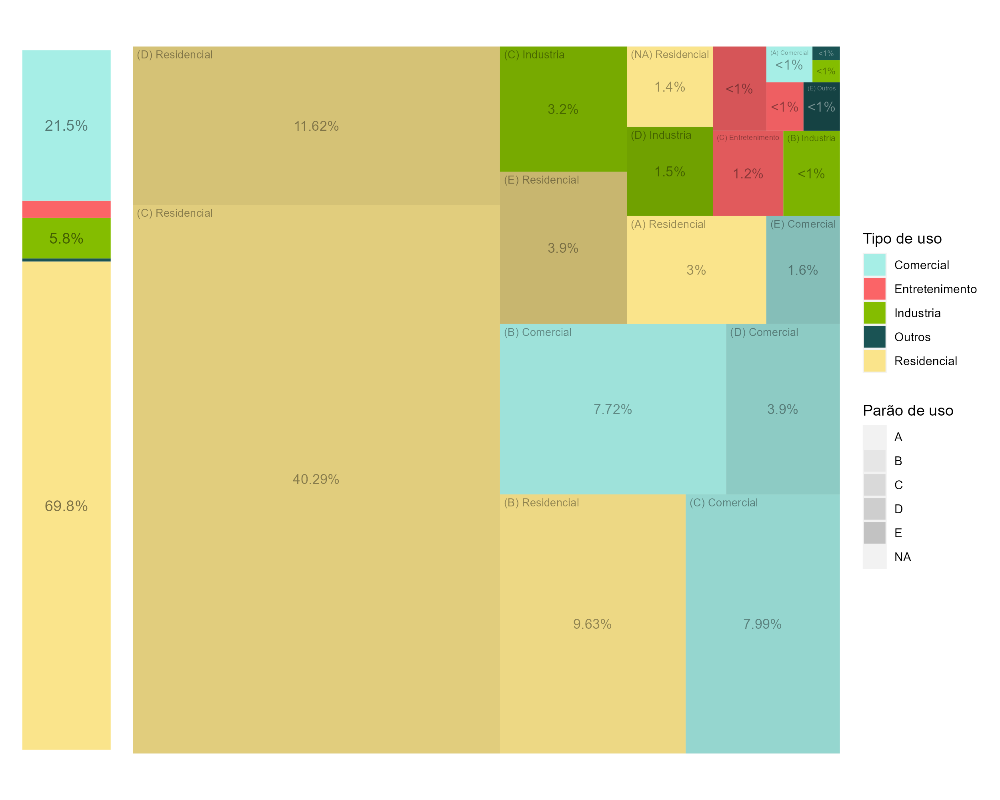
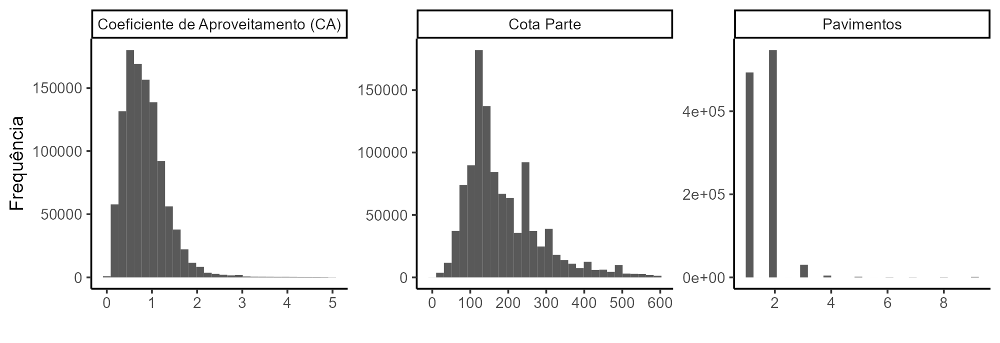
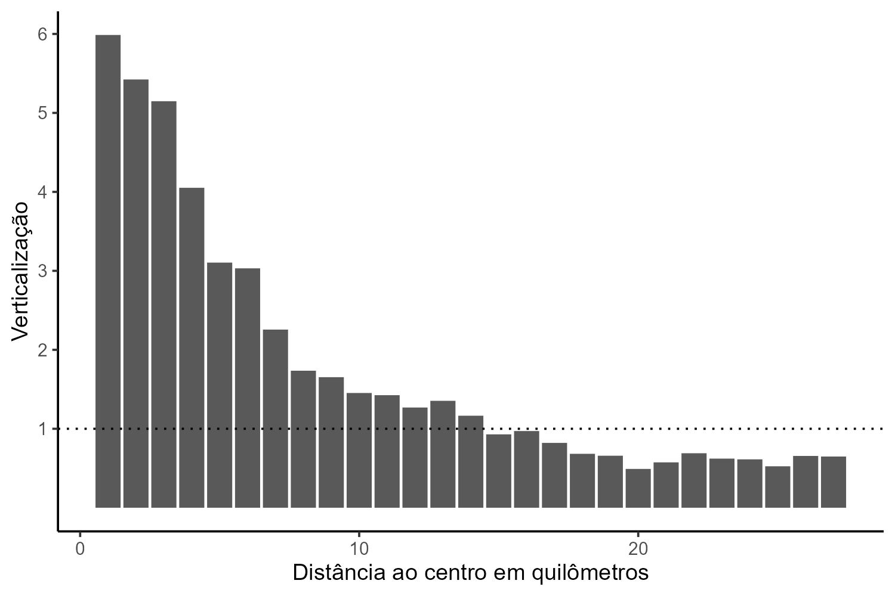

```{r setup, include=FALSE}
library(knitr)
opts_chunk$set(echo = TRUE, warning = FALSE, message = FALSE, cache.lazy = FALSE)
setwd("C:/git/densidade")
```

```{r, warning = FALSE, message = FALSE}
library(tidyverse)
library(sf)
library(kableExtra)
library(units)
library(gt)
library(patchwork)
library(purrr)
library(ggtext)

set.seed(123)

distrito <- read_sf("dados/distrito/SIRGAS_SHP_distrito.shp") %>% st_set_crs("epsg:31983")
```

## Microdados do Censo de 2022

É importante destacar que os resultados disponíveis são parciais do censo, com dados atualizados até o momento da divulgação. No entanto, mesmo parciais, esses dados podem ser extremamente úteis para suas análises.

Um ponto crucial a considerar é que o nível mínimo de observação georreferenciada nos microdados do censo são os setores censitários. Os setores censitários são unidades geográficas definidas pelo Instituto Brasileiro de Geografia e Estatística (IBGE) para coleta e tabulação de dados censitários. Eles são delimitados de forma a garantir uma cobertura completa e homogênea de todo o território nacional, facilitando a análise comparativa entre diferentes áreas geográficas. A delimitação geográfica do setor também considera questões logísticas para o entrevistador conseguir entrevistar a todos.


```{r data_censo_import, cache = TRUE}
# Read dados do censo 2022
censo <- read_sf("dados/censo/SP_Malha_Preliminar_2022.shp") %>% 
  filter(CD_MUN == "3550308") %>% 
  st_transform("epsg:31983") %>% # Sistema de coordenadas do geosampa
  select(id_setor_censitario = CD_SETOR, v0001:v0007) %>% 
  mutate(area_setor = st_area(geometry))
```

```{r, echo = FALSE}
censo %>% 
  ungroup() %>% sample_n(10) %>% 
  kbl() %>% 
  kable_styling(bootstrap_options = c("striped", "hover", "condensed", "responsive"),
                font_size = 10)
```

```{r plot_censo, cache = TRUE}
gg <- ggplot() +
  geom_sf(data = censo %>%
            mutate(densidade = v0001/area_setor,
                   decil = ntile(densidade, 10)),
          aes(fill = factor(decil)), color = NA) +
  scale_fill_viridis_d() +
  labs(fill = "Decil de densidade") +
  theme_void()

ggsave("tex/imagens/mapa.png", gg, width = 20, height = 20, dpi = 400)
```

```{r, echo=FALSE, out.width = '100%'}
knitr::include_graphics("tex/imagens/mapa.png")
```

```{r}
descritiva <- censo %>% 
  st_drop_geometry() %>% 
  summarize("Total de pessoas" = sum(v0001),
            "Total de Domicílios" = sum(v0002),
            "Total de Domicílios Particulares Ocupados" = sum(v0007)) %>% 
  pivot_longer(everything())
```

```{r, echo = FALSE}
descritiva %>% 
  kbl(format.args = list(big.mark = ".")) %>% 
  kable_styling(bootstrap_options = c("striped", "hover", "condensed", "responsive"),
                font_size = 10)
remove(descritiva)
```

```{r plot_densidade_distancia, cache = TRUE}
censo %>% 
  mutate(distancia_centro = st_distance(geometry, 
                                        read_sf("dados/distrito/SIRGAS_SHP_distrito.shp") %>% 
                                          st_set_crs("epsg:31983") %>% 
                                          filter(ds_nome == "SE")) %>% 
           as.numeric() %>% 
           cut(breaks = 10^3*(0:40), labels = FALSE)) %>% 
  st_drop_geometry() %>%
  group_by(distancia_centro) %>% 
  summarize(densidade = sum(v0001) / sum(as.numeric(area_setor) / 10^6)) %>% 
  ggplot(aes(x = distancia_centro, y = densidade)) +
  geom_col() +
  scale_y_continuous(labels = scales::comma_format(big.mark = ".")) +
  scale_x_continuous(labels = scales::comma_format(big.mark = ".")) +
  labs(x = "Distância ao centro em quilômetros", 
       y = "Densidade populacional por quilômetro quadrado") +
  theme_classic()
```

# Base de Dados do IPTU

A base de dados do IPTU (Imposto Predial e Territorial Urbano) é uma fonte abrangente de informações sobre imóveis urbanos dentro do município. Essa base é considerada completa, pois abrange todos os imóveis sujeitos à tributação do IPTU, representando uma fonte confiável e abrangente de informações sobre a propriedade urbana. Propriedades que não foram construídas dentro da legalidade não constam nessa base.

O número do contribuinte, utilizado para identificar exclusivamente cada imóvel na base de dados do IPTU, é representado diretamente pelo SQL, sendo essencial para consultas e manipulação dos dados relacionados ao imposto predial e territorial urbano. Esse formato permite a integração e cruzamento com outras bases de dados, como a base de lotes, que está georreferenciada, fornecendo informações espaciais adicionais que não estão disponíveis na base do IPTU.

## Procedimento para Lotes de Condomínios

Quando um lote é um condomínio, ou seja, quando não se classifica de acordo com `condominio == "00-0"`, é necessário substituir os múltiplos números de SQL pelo número do condomínio. Isso ocorre porque cada unidade dentro do condomínio pode ser tratada como uma entidade separada para fins tributários, mas para a base de lotes, estão todos juntos.


```{r data_IPTU_import, cache = TRUE}
IPTU <- read.csv("dados/IPTU/IPTU_2024.csv", sep=";", encoding = "latin1") %>% 
    as_tibble() %>% 
    select(sql = "NUMERO.DO.CONTRIBUINTE", 
           condominio = "NUMERO.DO.CONDOMINIO",
           area_terreno = "AREA.DO.TERRENO",
           area_construida = "AREA.CONSTRUIDA",
           area_ocupada = "AREA.OCUPADA",
           pavimentos = "QUANTIDADE.DE.PAVIMENTOS",
           ano_construcao = "ANO.DA.CONSTRUCAO.CORRIGIDO",
           tipo = "TIPO.DE.PADRAO.DA.CONSTRUCAO") %>% 
    
    # Separação do número de contribuinte (SQL) em setor quadra e lote
    mutate(setor =  str_sub(sql, 1, 3),
           quadra = str_sub(sql, 4, 6),
           
           # Quando o lote é um condomínio, haverá vários SQLs no mesmo lote. CD = Condomínio
           lote = str_sub(sql, 7, 10) %>% 
             ifelse(condominio == "00-0", ., paste("CD", str_sub(condominio, 1, 2), sep = "")),
           
           # Tipo de uso
           residencial = str_detect(tipo, "Residencial"),
           
           # Medida de verticalização
           verticalizacao = pavimentos * area_ocupada / area_terreno)
```

```{r, echo = FALSE}
IPTU %>% 
  ungroup() %>% sample_n(8) %>% 
  kbl() %>% 
  kable_styling(bootstrap_options = c("striped", "hover", "condensed", "responsive"),
                font_size = 10)
```

## Tipos de uso para IPTU

Todos os empreendimentos não públicos regulares (de acordo com a lei) constam nesta base de dados. A seguir está uma análise de quais são estes tipos. O tipo de interesse para esta análise é apenas os residenciais.


```{r plot_area_construida, cache = TRUE}
gg.right <- IPTU %>% 
  mutate(uso = case_when(str_detect(tipo, "Residencial") ~ "Residencial",
                         str_detect(tipo, "Comercial") ~ "Comercial",
                         str_detect(tipo, "Oficina") ~ "Industria",
                         str_detect(tipo, "TERRENO") ~ "Terreno",
                         str_detect(tipo, "Clube") ~ "Entretenimento",
                         .default = "Outros") %>% as.factor(),
         padrao = case_when(str_detect(tipo, "A$") ~ "A",
                            str_detect(tipo, "B$") ~ "B",
                            str_detect(tipo, "C$") ~ "C",
                            str_detect(tipo, "D$") ~ "D",
                            str_detect(tipo, "E$") ~ "E",
                            .default = "NA"),
         nome = paste("(", padrao, ") ", uso, sep = "")) %>% 
  group_by(uso, padrao, nome) %>% 
  summarize(area = sum(area_construida)) %>% 
  ungroup() %>% 
  mutate(percentual = area * 100/ sum(area, na.rm = TRUE),
         texto = case_when(percentual < 1 ~ "<1%",
                           percentual < 5 ~ paste(round(percentual,1), "%", sep = ""),
                           .default = paste(round(percentual, 2), "%", sep = "")),
         color = ifelse(uso == "Outros", "white", "black")) %>% 
  ggplot() +
  treemapify::geom_treemap(aes(fill = uso, area = area), size = 2, color = NA) +
  treemapify::geom_treemap(aes(alpha = padrao, area = area), fill = "black", color = NA) +
  treemapify::geom_treemap_text(aes(area = area, label = nome, color = color), alpha = .4, grow = FALSE, size = 8) +
  treemapify::geom_treemap_text(aes(area = area, label = texto, color = color), 
                                alpha = .4, place = "middle", size = 10) +
  scale_fill_manual(values = c("Residencial" = "#FAE48B", 
                               "Comercial" = "#A6EEE6",
                               "Industria" = "#84BD00",
                               "Entretenimento" = "#FB6467",
                               "Outros" = "#1A5354")) +
  scale_alpha_manual(values = c("A" = 0, "B" = .05, "C" = .1, "D" = .15, "E" = .2, "NA" = 0)) +
  scale_color_manual(values = c("black" = "black", "white" = "white")) +
  labs(fill = "Tipo de uso", alpha = "Parão de uso") +
  theme(aspect.ratio=1)

gg.left <- IPTU %>% 
  mutate(uso = case_when(str_detect(tipo, "Residencial") ~ "Residencial",
                         str_detect(tipo, "Comercial") ~ "Comercial",
                         str_detect(tipo, "Oficina") ~ "Industria",
                         str_detect(tipo, "TERRENO") ~ "Terreno",
                         str_detect(tipo, "Clube") ~ "Entretenimento",
                         .default = "Outros") %>% as.factor()) %>% 
  group_by(uso) %>% 
  summarize(area = sum(area_construida, na.rm = TRUE)) %>% 
  ungroup() %>% 
  arrange(desc(uso)) %>% 
  mutate(percentual = area * 100 / sum(area, na.rm = TRUE),
         texto = ifelse(percentual > 5, paste(round(percentual, 1), "%", sep = ""), ""),
         ytext = (cumsum(area) + lag(cumsum(area)))/ 2) %>% 
  ggplot() +
  geom_col(aes(y = area, fill = uso, x = "")) +
  geom_text(aes(y = ytext, fill = uso, x = "", label = texto), alpha = .5) +
  scale_fill_manual(values = c("Residencial" = "#FAE48B", 
                               "Comercial" = "#A6EEE6",
                               "Industria" = "#84BD00",
                               "Entretenimento" = "#FB6467",
                               "Outros" = "#1A5354")) +
  theme_void() +
  theme(legend.position = "none")

ggsave("tex/imagens/tree_area_construida.png", 
       (gg.left | gg.right) + 
         plot_layout(widths = c(1,6)), 
       width = 10, height = 8, dpi = 250)

```

```{r, echo=FALSE, out.width = '100%'}

remove(gg.left, gg.right)
```

## Agrupamento dos condomínios

Quando há um condomínio com múltiplos contribuintes de IPTU, ele deve ser agregado a nível lote, para que possa ser cruzado com a base de lotes, possibilitando que seja georreferenciada. Todos os contribuintes dentro de um condomínio compartilham das mesmas características de área de terreno, área ocupada, ano de construção e pavimentos, então a mediana funciona para agregar estes dados, mas o máximo, mínimo, média ou pegar o primeiro valor também funcionaria.


```{r data_IPTU_tidy, cache = TRUE}
IPTU <- IPTU %>% 
  group_by(setor, quadra, lote) %>% 
  
  # Agregar por SQL
  group_by(setor, quadra, lote) %>% 
  summarize(unidades = n(),
            area_terreno = median(area_terreno), 
            area_construida = sum(area_construida), 
            area_ocupada = median(area_ocupada),
            pavimentos = median(pavimentos),
            ano_construcao = median(ano_construcao),
            residencial = median(residencial),
            verticalizacao = median(verticalizacao)) %>% 
  ungroup()
```

```{r, echo = FALSE}
IPTU %>% 
  ungroup() %>% sample_n(8) %>% 
  kbl() %>% 
  kable_styling(bootstrap_options = c("striped", "hover", "condensed", "responsive"),
                font_size = 10)
```

```{r}
IPTU %>% 
  mutate(unitario = unidades == 1) %>% 
  group_by(unitario) %>% 
  summarize(n = n(),
            soma = sum(unidades))
```


```{r plot_indicadores, cache = TRUE}
gg <- IPTU %>% 
  ungroup() %>% 
  mutate(CA = area_construida / area_terreno,
         cota_parte = area_terreno / unidades) %>% 
  filter(cota_parte < 600, CA < 5, verticalizacao < 5) %>% 
  select("Cota Parte" = cota_parte, "Coeficiente de Aproveitamento (CA)" = CA, "Verticalização" = verticalizacao) %>% 
  pivot_longer(everything()) %>% 
  ggplot() +
  geom_histogram(aes(x = value)) +
  facet_wrap(~ name, scales = "free_x") +
  labs(title = "Distribuição dos indicadores em SP", x = "", y = "Frequência") + 
  theme_classic()

ggsave("tex/imagens/indicadores.png", gg, width = 9, height = 4, dpi = 250)

```

```{r, echo=FALSE, out.width = '90%'}

remove(gg)
```

# Geosampa

GeoSampa é o portal de mapas e dados geoespaciais da cidade de São Paulo, mantido pela prefeitura. Ele fornece uma vasta gama de informações geográficas, incluindo mapas, dados demográficos, infraestruturas e muito mais. Este portal é uma ferramenta valiosa para pesquisadores, urbanistas e qualquer pessoa interessada em informações espaciais detalhadas sobre a cidade.

https://geosampa.prefeitura.sp.gov.br/

# Lotes
Base de Lotes: No GeoSampa, a base de lotes representa a divisão da cidade em pequenos segmentos, geralmente correspondentes a terrenos individuais ou condomínios. Esta base está organizada de forma que cada bairro tem seu próprio conjunto de dados e os dados de lotes para cada bairro podem ser baixados diretamente do site do GeoSampa em formato zip, contendo arquivos como .shp (shapefile), .dbf (database file), e .shx (index file).


```{r}
# Extração do zip file com lotes de cada bairro
if (!"zip" %in% list.files(path = "dados/lotes")){
  for (file in list.files(path="dados/lotes/zip", full.names = FALSE) %>% 
       str_remove("\\.zip")){
    unzip(paste("dados/lotes/zip/", file, ".zip", sep = ""), 
          paste(file, "/", file, ".shp", sep = ""), 
          exdir = "dados/lotes/unzip")
    unzip(paste("dados/lotes/zip/", file, ".zip", sep = ""), 
          paste(file, "/", file, ".dbf", sep = ""), 
          exdir = "dados/lotes/unzip")
    unzip(paste("dados/lotes/zip/", file, ".zip", sep = ""), 
          paste(file, "/", file, ".shx", sep = ""), 
          exdir = "dados/lotes/unzip")
  }
}
```

```{r data_lotes_import, cache = TRUE}
# Junção dos shapes dos lotes de cada bairro em uma tabela
lotes <- list.files(path="dados/lotes/unzip", full.names = FALSE) %>% 
    paste("dados/lotes/unzip/", ., "/", ., ".shp", sep = "") %>% 
    lapply(read_sf) %>% 
    bind_rows %>% 
    st_set_crs("epsg:31983") 

```

```{r, echo = FALSE}
lotes %>% 
  ungroup() %>% sample_n(8) %>% 
  kbl() %>% 
  kable_styling(bootstrap_options = c("striped", "hover", "condensed", "responsive"),
                font_size = 10)
```

## Tipos de lotes

Os lotes podem ser classificados de três formas

- Lotes fiscais: apresentam contribuintes do IPTU
- Espaço livre: espaços públicos
- Via de acesso: Ruas fechadas para acesso dentro de uma quadra

Os lotes fiscais podem ser unidades ou condomínios. Um prédio, por exemplo, fica em um único lote, mas dentro pode haver diversas unidades, então se configura como um condomínio. Não é possível saber através dos dados de lotes quantas unidades estão no condomínio, nem alguma forma de discriminá-los.


```{r plot_lotes, cache = TRUE}
lotes %>% 
  mutate(condominio = case_when(lo_condomi == "00" ~ "Unidade",
                                lo_condomi != "00" ~ "Condomínio"),
         tipo = case_when(lo_tp_lote == "F" ~ "Fiscal",
                          lo_tp_lote == "M" ~ "Espaço livre",
                          lo_tp_lote == "V" ~ "Via de acesso",
                          .default = NA),
         area = st_area(geometry) %>% as.numeric()) %>% 
  st_drop_geometry() %>% 
  ggplot() +
  geom_violin(aes(x = factor(condominio), y = area, fill = tipo)) +
  scale_y_log10(labels = scales::comma_format(big.mark = ".")) +
  labs(title = "Área dos lotes em SP" , x = "", y = "Área em metros quadrados", fill = "Tipo de lote") +
  theme_classic()
```


## SQL dos Lotes (Setor, Quadra e Lote)
Na base de dados de lotes, cada lote é identificado por três componentes principais:

1. Setor (lo_setor): Uma divisão maior dentro do município que agrupa várias quadras.
2. Quadra (lo_quadra): Uma subdivisão dentro de um setor que agrupa vários lotes.
3. Lote (lo_lote): A menor unidade de divisão, que representa um terreno ou uma parcela específica dentro de uma quadra.
Essa estrutura de Setor-Quadra-Lote é crucial para identificar de forma única cada lote dentro do município. No código, esses identificadores são utilizados para manipular e cruzar os dados de lotes com outras bases de dados, como a base de IPTU.

```{r data_lotes_tidy, cache = TRUE}
lotes <- lotes %>% 
 filter(lo_tp_lote == "F") %>% # Seleção apenas de lotes fiscais
  mutate(lo_lote = ifelse(lo_lote == "0000", paste("CD", lo_condomi, sep = ""), lo_lote)) %>% 
  select(setor = lo_setor, quadra = lo_quadra, lote = lo_lote)
```

```{r, echo = FALSE}
lotes %>% 
  ungroup() %>% sample_n(8) %>% 
  kbl() %>% 
  kable_styling(bootstrap_options = c("striped", "hover", "condensed", "responsive"),
                font_size = 10)
```

## Base de quadras

```{r data_quadras_import, cache = TRUE}
quadras <- read_sf("dados/quadras/SIRGAS_SHP_quadraMDSF.shp") %>% 
  st_set_crs("epsg:31983") %>% 
  filter(qd_tipo == "F") %>% # Apenas quadras fiscais
  select(setor = qd_setor, quadra = qd_fiscal) %>% 
  group_by(setor, quadra) %>% 
  summarize(geometry = st_union(geometry)) %>% 
  ungroup()
```


## Base de setores

```{r data_setores_import, cache = TRUE}
setores <- read_sf("dados/setor/SIRGAS_SHP_setorfiscal.shp") %>% 
  st_set_crs("epsg:31983") %>% 
  select(setor = st_codigo) %>% 
  group_by(setor) %>% 
  summarize(geometry = st_union(geometry)) %>% 
  ungroup()
```


# Join entre a Base de Lotes e a Base do IPTU

```{r data_join_IPTU-lote, cache = TRUE}
# Join dos lotes com IPTU com base no SQL
IPTU.lote <- IPTU %>% 
  filter(residencial == 1) %>% 
  left_join(lotes, by = join_by(setor, quadra, lote)) %>% 
  ungroup()
```

```{r, echo = FALSE}
IPTU.lote %>% 
  ungroup() %>% sample_n(8) %>% 
  kbl() %>% 
  kable_styling(bootstrap_options = c("striped", "hover", "condensed", "responsive"),
                font_size = 10)
```

```{r data_join_IPTU-quadra, cache = TRUE}
IPTU.quadra <- IPTU %>% 
  filter(residencial == 1) %>% 
  group_by(setor, quadra) %>% 
  summarize(unidades = sum(unidades),
            area_construida = sum(area_construida),
            verticalizacao = weighted.mean(verticalizacao, area_terreno),
            area_terreno = sum(area_terreno)) %>% 
  left_join(quadras, by = join_by(setor, quadra)) %>% 
  ungroup()
```

```{r data_join_IPTU-setor, cache = TRUE}
IPTU.setor <- IPTU %>% 
  filter(residencial == 1) %>% 
  group_by(setor) %>% 
  summarize(unidades = sum(unidades),
            area_construida = sum(area_construida),
            verticalizacao = weighted.mean(verticalizacao, area_terreno),
            area_terreno = sum(area_terreno)) %>% 
  left_join(setores, by = join_by(setor)) %>% 
  ungroup()
```

```{r}
list(IPTU %>% filter(residencial == 1) %>% mutate(base = "bruta"), 
     IPTU.setor  %>% mutate(base = "Setor")  %>% filter(!geometry %>% st_is_empty()), 
     IPTU.quadra %>% mutate(base = "Quadra") %>% filter(!geometry %>% st_is_empty()), 
     IPTU.lote   %>% mutate(base = "Lote")   %>% filter(!geometry %>% st_is_empty())) %>% 
  lapply(function(x) x %>% 
           group_by(base) %>% 
           summarize(unidades = sum(unidades))) %>% 
  bind_rows %>% 
  pivot_wider(names_from = base, values_from = unidades) %>% 
  pivot_longer(2:4) %>% 
  mutate(missing = bruta - value,
         missing_percent = (100 *missing / bruta) %>% round(2) %>% paste("%")) %>% 
  select("Critério de join" = name,
         "Erros (unidades)" = missing,
         "Percentual de erro" = missing_percent)
```


## Algumas estatísticas descritivas

```{r plot_verticalizacao, cache = TRUE}
gg <- IPTU.lote %>% 
  mutate(distancia_centro = st_distance(geometry, 
                                        read_sf("dados/distrito/SIRGAS_SHP_distrito.shp") %>% 
                                          st_set_crs("epsg:31983") %>% 
                                          filter(ds_nome == "SE")) %>% 
           as.numeric() %>% 
           cut(breaks = 10^3*(0:40), labels = FALSE)) %>% 
  st_drop_geometry() %>% 
  group_by(distancia_centro) %>% 
  summarize(verticalizacao = weighted.mean(verticalizacao, area_terreno)) %>% 
  ggplot(aes(x = distancia_centro, y = verticalizacao)) +
  geom_col() +
  geom_hline(yintercept = 1, linetype = "dotted") +
  labs(x = "Distância ao centro em quilômetros", 
       y = "Verticalização") + 
  scale_y_continuous(breaks = (1:6)) +
  theme_classic()

ggsave("tex/imagens/verticalizacao.png", gg, width = 6, height = 4, dpi = 250)

```

```{r, echo=FALSE, out.width = '75%'}

remove(gg)
```

```{r}
gg.lotes <- IPTU.quadra %>% 
  ggplot() +
  geom_sf(data = distrito, fill = "black") +
  geom_sf(aes(fill = verticalizacao, geometry = geometry), color = NA) +
  theme_void() +
  scale_fill_gradient(low = "#004D40FF", high = "#E0F2F1FF")

gg.setor <- IPTU.setor %>% 
  ggplot() +
  geom_sf(data = distrito, fill = "black") +
  geom_sf(aes(fill = verticalizacao, geometry = geometry), color = NA) +
  theme_void() +
  scale_fill_gradient(low = "#004D40FF", high = "#E0F2F1FF")

ggsave("tex/imagens/mapa_verticalizacao.png", 
       (gg.lotes | gg.setor), width = 20, height = 20, dpi = 300)

```


```{r, echo=FALSE, out.width = '75%'}
knitr::include_graphics("tex/imagens/mapa_verticalizacao.png")
remove(gg)
```

# Cruzamento entre a Base do Censo e a Base do IPTU

O processo de cruzamento foi realizado com base na intersecção das geometrias dos setores censitários e dos lotes do IPTU. Cada setor censitário e cada lote do IPTU possui uma geometria associada, representando sua área geográfica no mapa. Ao cruzar essas geometrias, é possível identificar quais lotes estão contidos em cada setor censitário e vice-versa.

É importante destacar que, em casos onde um lote foi dividido entre dois ou mais setores censitários, ocorrerá uma intersecção em ambas as áreas. Para lidar com essa situação, foi calculado o percentual da área do lote que está contida em cada setor censitário.


```{r data_join_IPTU-censo, cache = TRUE}
# Join dados do IPTU com do Censo através da intersecção das geometrias
IPTU.censo <- censo %>% 
  st_intersection(IPTU.lote %>% st_as_sf()) %>% 
  as_tibble() %>% 
  rename(geometria_intersec = geometry) %>% 
  
  # Retomada das geometrias do setor e lotes
  left_join(censo %>% 
              as_tibble() %>% 
              select(id_setor_censitario, 
                     geometria_setor_censitario = geometry),
            by = join_by(id_setor_censitario)) %>% 
  left_join(IPTU.lote %>% 
              as_tibble() %>% 
              select(setor, quadra, lote, 
                     geometria_lote = geometry),
            by = join_by(setor, quadra, lote)) %>% 
  
  # Cálculo de quanto % do lote está dentro do setor
  mutate(percent_intersec = as.numeric(st_area(geometria_intersec) / st_area(geometria_lote))) 
```

```{r, echo = FALSE}
IPTU.censo %>% 
  ungroup() %>% sample_n(10) %>% 
  kbl() %>% 
  kable_styling(bootstrap_options = c("striped", "hover", "condensed", "responsive"),
                font_size = 10)
```

# Erros no join

## Disparidades de informações

Teoricamente o número de domicílios deveria ser próximo do número de unidades habitacionais enunciadas pelo IPTU. Caso haja mais unidades habitacionais do que domicílios, houve algum equívoco na medição do censo, visto que entre domicílios não contam apenas os ocupados. Caso haja mais domicílios, há unidades que não são contribuintes do IPTU. O que é preocupante é que casos em que o número é diferente não são exceções.

```{r plot_disparidade_IPTU-censo, cache = TRUE}
gg <- censo %>% 
  st_drop_geometry() %>% 
  select(id_setor_censitario, domicilios = v0002) %>% 
  left_join(IPTU.censo %>% 
              st_drop_geometry() %>% 
              filter(residencial == 1) %>% 
              group_by(id_setor_censitario) %>% 
              summarize(unidades = sum(unidades))) %>% 
  mutate(unidades = replace_na(unidades, 0)) %>% 
  mutate(balanco = unidades / (unidades + domicilios)) %>% 
  ggplot() +
  geom_histogram(aes(x = balanco)) +
  labs(caption = "Caso o balanço seja 50%, implica que o número de domicílios reportados no censo é igual ao número de 
unidades reportadas no IPTU. Caso o balanço seja menor que 50%, implica que há mais domicílios no censo 
do que unidades, e caso seja maior que 50%, há mais unidades que domicílios",
title = "Disparidade entre censo e IPTU quanto ao número de unidades habitacionais",
    
       x = "Balanço: unidades / (unidades + domicilios)", y = "") +
  theme_classic() +
    theme(plot.caption = element_text(hjust = 0)) +
  scale_x_continuous(labels = scales::percent)


ggsave("tex/imagens/disparidade_censoIPTU.png", gg, width = 8, height = 5, dpi = 400)
```


```{r, echo=FALSE, out.width = '100%'}
knitr::include_graphics("tex/imagens/disparidade_censoIPTU.png")
```

## Perfil geográfico dos erros

Alguns setores censitários não encontram pares na base de lotes. Isso acontece principalmente por conta de loteamentos irregulares e favelas, que não são contribuintes do IPTU, e, portanto, não constam na base. Isso não prejudica a análise, pois estes loteamentos não dependem da regulamentação urbana, então mudanças nos instrumentos e indicadores não impactariam essas regiões.

Outras falhas decorrem do erro do join da base do IPTU com lotes, como apontado anteriormente, mas estes casos são negligenciáveis.


```{r plot_erros_join_favelas, cache = TRUE}
distrito <- read_sf("dados/distrito/SIRGAS_SHP_distrito.shp") %>% st_set_crs("epsg:31983")
lotes_irregulares <- read_sf("dados/lotes_irregulares/SIRGAS_SHP_loteamento.shp") %>%
  st_set_crs("epsg:31983")
favela <- read_sf("dados/favela/SIRGAS_SHP_favela.shp") %>% 
  st_set_crs("epsg:31983")

censo.pontos <- censo %>%
  select(id_setor_censitario, geometry, pessoas = v0001, domicilios = v0002) %>%
  mutate(pontos = round(pessoas / 100)) %>% 
  as_tibble() %>% 
  left_join(
            # Seleção dos setores censitários que não apresentam nenhum contribuinte do IPTU
            censo %>% 
              anti_join(IPTU.censo) %>% 
              st_drop_geometry() %>% 
              select(id_setor_censitario) %>% 
              mutate(erro = TRUE)) %>% 
  mutate(erro = replace_na(erro, FALSE)) %>% 
  mutate(samples = map2(geometry, pontos, ~st_sample(.x, size = .y))) %>%
  unnest(cols = samples) %>%
  as_tibble()

gg <- censo.pontos %>% 
  ggplot() +
  geom_sf(data = distrito, color = NA) +
  geom_sf(data = st_union(favela %>% st_union() %>% st_buffer(10),
                          lotes_irregulares %>% st_union() %>% st_buffer(10)),
          aes(fill = "Favelas e lotes irregulares"), 
        color = "black", size = .1, alpha = .7) +
  geom_sf(aes(geometry = samples, color = erro), alpha = .25, size = .2) +
  scale_color_manual(values = c("FALSE" = NA,#248232
                               "TRUE" = "#D32934FF"),
                     labels = NULL) +
  scale_fill_manual("", values = c("Favelas e lotes irregulares" = "#2BAA92FF")) +
  labs(title = "<span style='font-size: 35pt;'>População em <span style = 'color:#D32934FF;'>áreas sem registro de IPTU</span> geralmente estão em <br><span style = 'color:#2BAA92FF;'>favelas ou lotes irregulares</span> (cada ponto representa 100 pessoas)</span>") + 
  theme_void() +
  theme(plot.title = element_markdown(), legend.position = "none")

# scale_colour_paletteer_d("lisa::AndyWarhol_2")

ggsave("tex/imagens/mapa_pontos.png", gg, width = 18, height = 20, dpi = 300)
```

```{r, echo=FALSE, out.width = '100%'}
knitr::include_graphics("tex/imagens/mapa_pontos.png")
remove(favela, gg, lotes_irregulares, IPTU.lote, censo.pontos)
```

